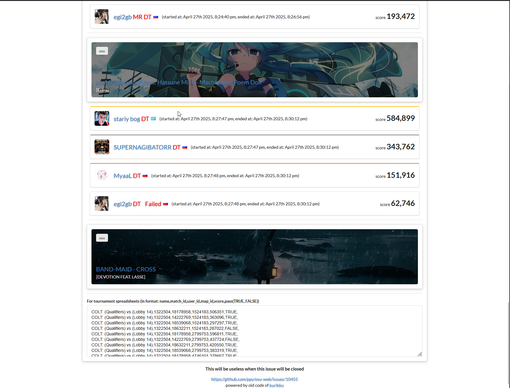

# lazer-mp-viewer

Repository with code for a simple lobby lazer viewer

https://kotrikd.github.io/lazer-mp-viewer/

If this was useful for you, donate me for i dunno coffee??
https://boosty.to/kotrik/donate

---
- Provides legacy score viewing for lazer playlist lobby
- Provides useful ctrl+c, ctrl+v for tournament spreadsheets
---

